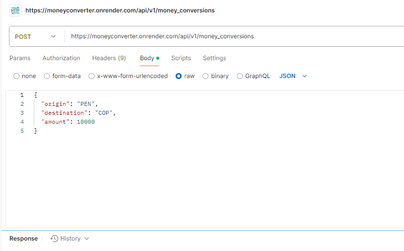

<a name="readme-top"></a>

<div align="center">
   <h3><b>Money Conversion API</b></h3>
</div>

<!-- TABLE OF CONTENTS -->

# 📗 Table of Contents

- [📖 About the Project](#about-project)
  - [🛠 Built With](#built-with)
    - [Tech Stack](#tech-stack)
    - [Key Features](#key-features)
  - [🚀 Live Demo](#live-demo)
- [💻 Getting Started](#getting-started)
  - [Prerequisites](#prerequisites)
  - [Setup](#setup)
  - [Install](#install)
  - [Usage](#usage)
  - [Run tests](#run-tests)
  - [Deployment](#triangular_flag_on_post-deployment)
- [👥 Authors](#authors)
- [🔭 Future Features](#future-features)
- [🤝 Contributing](#contributing)
- [⭐️ Show your support](#support)
- [🙏 Acknowledgements](#acknowledgements
- [📝 License](#license)

<!-- PROJECT DESCRIPTION -->

# 📖 Money Conversion API <a name="about-project"></a>

**Money Conversion API** es una API desarrollada en Ruby on Rails para convertir montos entre diferentes monedas. Utiliza tasas fijas o dinámicas, y está pensada para integrarse fácilmente en aplicaciones móviles o web.


# Funcionalidades principales

**Conversión de dinero entre monedas**:

Calcula la mejor conversión entre una moneda de origen y una de destino, usando intermediarios para encontrar tasas de cambio más eficientes.

**Obtención de datos de mercado**:

Usa la API de Buda.com para recuperar información sobre los mercados disponibles y los libros de órdenes.

**Cálculo en libros de órdenes**:

Utiliza el servicio 'OrderBookService' para procesar las órdenes de compra y venta, ajustando los precios y las cantidades disponibles según las necesidades de conversión.

### Cómo funciona
- El controlador principal (MoneyConversionsController) recibe los parámetros necesarios para la conversión, como moneda de origen, moneda de destino y cantidad a convertir.

- Se recupera una lista de mercados disponibles a través de 'ApiBudaService'.

- Se identifican intermediarios que conectan la moneda de origen con la moneda de destino.

- Se calcula la mejor conversión posible usando los intermediarios mediante el servicio 'OrderBookService'.

- Si se encuentra una conversión válida, la aplicación devuelve el monto convertido y el intermediario utilizado. En caso contrario, devuelve un mensaje de error.

### Estructura de los servicios
***ApiBudaService*** 
- Recupera datos de la API, como los mercados disponibles (fetch_markets_ids) y los libros de órdenes (order_book).

***OrderBookService***
- Procesa las órdenes de compra o venta en los libros de órdenes, ajustando los cálculos según los precios y las cantidades disponibles.

- Devuelve información detallada sobre si fue posible cumplir con la cantidad requerida, el costo total y la cantidad restante.


📥 **Ejemplo de request**

```
POST /api/v1/money_conversions
Content-Type: application/json

{
  "origin": "COP",
  "destination": "CLP",
  "amount": 20000
}
```


## 🛠 Built With <a name="built-with"></a>

- Ruby on Rails

- RSpec

- Swagger

### Tech Stack <a name="tech-stack"></a>

<details>
  <summary>Backend</summary>
  <ul>
    <li><a href="https://rubyonrails.org/">Ruby on Rails</a></li>
    <li><a href="https://rspec.info/">RSpec</a></li>
  </ul>
</details>

<!-- Features -->

### Key Features <a name="key-features"></a>

✅ Conversión entre monedas.

🔒 Validación de parámetros.

🧪 Pruebas unitarias y de integración.

🚀 Listo para despliegue.


<p align="right">(<a href="#readme-top">back to top</a>)</p>

<!-- LIVE DEMO -->

## 🚀 Live Demo <a name="live-demo"></a>

Se encuentra desplegado en render, lo puedes probar de 2 maneras

- usando postman , el end point es https://moneyconverter.onrender.com/api/v1/money_conversions




- usando la url -> https://moneyconverter.onrender.com/api-docs/index.html  se encuentra documentación creada con Swagger, se puede probar directamente el end-pint.


<p align="right">(<a href="#readme-top">back to top</a>)</p>

<!-- GETTING STARTED -->

## 💻 Getting Started <a name="getting-started"></a>

Para obtener una copia local del proyecto, sigue los pasos a continuación.

### Prerequisites

- Ruby >= 3.5

- Rails >= 7

- PostgreSQL


## Setup

- git clon https://github.com/CesarHerr/MoneyConverter.git


### Install

- bundle install

### Usage

Para iniciar el servidor: 

- rails server


Realiza una solicitud `POST` a:

POST http://localhost:3000/api/v1/money_conversions Content-Type: application/json

{ "origin": "CLP", "destination": "COP", "amount": 10000 }


## Run tests

bundle exec rspec

### Deployment


- [Render](https://render.com)


<p align="right">(<a href="#readme-top">back to top</a>)</p>

<!-- AUTHORS -->

## 👥 Authors

👤 **Cesar Herrera**

- GitHub: [@cesarherr](https://github.com/cesarherr)
- LinkedIn: [cesarherr](https://www.linkedin.com/in/cesarherr)

<p align="right">(<a href="#readme-top">back to top</a>)</p>

<!-- FUTURE FEATURES -->


<p align="right">(<a href="#readme-top">back to top</a>)</p>

<!-- CONTRIBUTING -->

## 🤝 Contributing <a name="contributing"></a>

Contribuciones, issues y sugerencias son bienvenidas.  
Revisa la pestaña [issues](https://github.com/CesarHerr/MoneyConverter/issues) para más información.

<p align="right">(<a href="#readme-top">back to top</a>)</p>

<!-- SUPPORT -->

## ⭐️ Show your support <a name="support"></a>

Si te gusta este proyecto, por favor dale una ⭐️ en GitHub y compártelo con otros.

<p align="right">(<a href="#readme-top">back to top</a>)</p>

<!-- ACKNOWLEDGEMENTS -->

## 🙏 Acknowledgements <a name="acknowledgements"></a>

Gracias a todos los desarrolladores open-source que comparten su conocimiento.


<p align="right">(<a href="#readme-top">back to top</a>)</p>

<!-- LICENSE -->

## 📝 License <a name="license"></a>

Este proyecto está licenciado bajo la licencia [MIT](./LICENSE).

<p align="right">(<a href="#readme-top">back to top</a>)</p>
